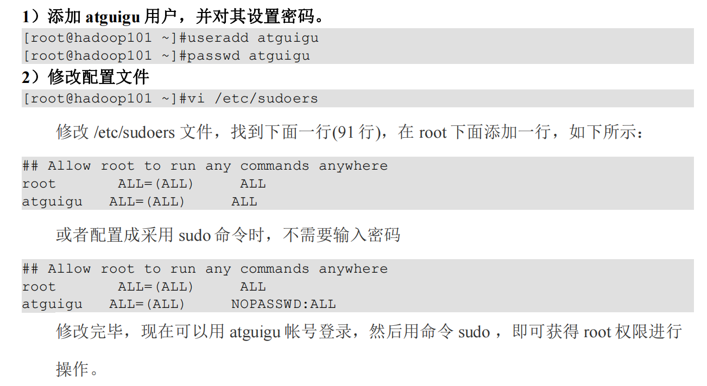
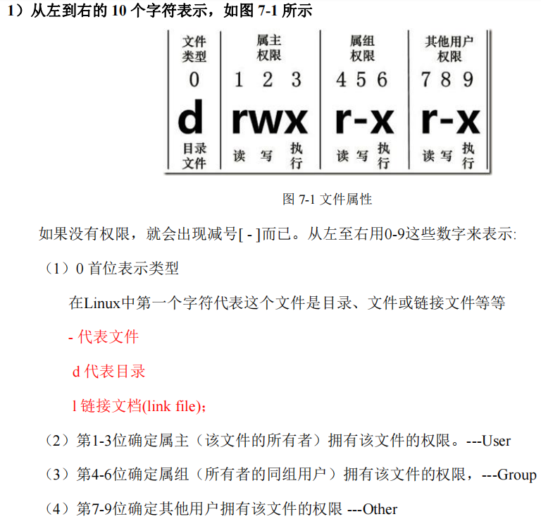
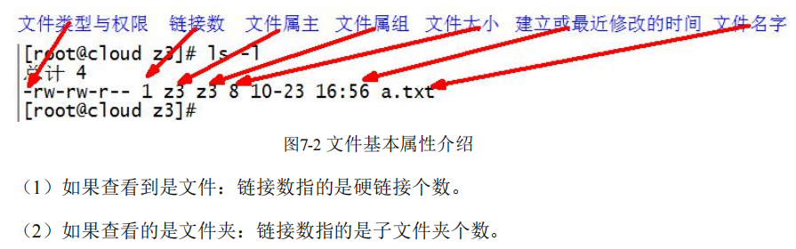
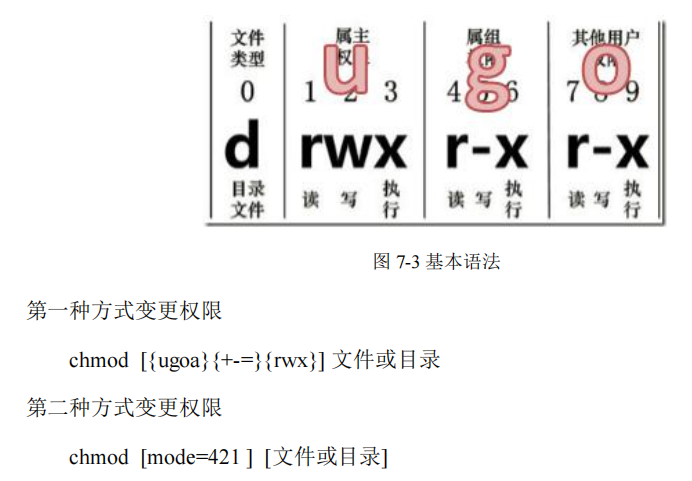
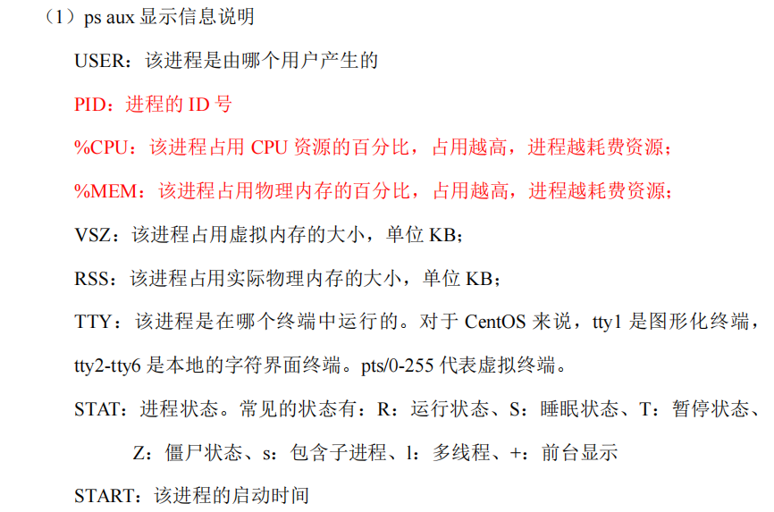
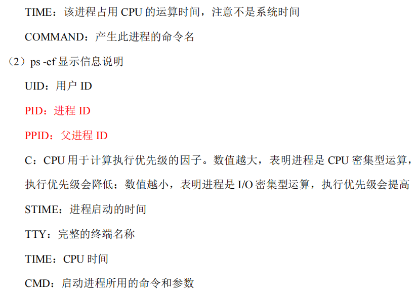

# Linux_note
## Linux常用基本命令
### 1.帮助命令
#### 1.1 man获得帮助信息
<mark> 基本语法： <mark> 
man [命令或配置文件]

(功能描述：获得帮助信息)

#### 1.2 help获得shell内置命令的帮助信息
一部分基础功能的系统命令是直接内嵌在shell中的，系统加载启动之后会随着shell一起加载，常驻系统内存中。这部分命令被称为“内置命令”；相应的其他命令被称为“外部命令”。

<mark> 基本语法： <mark> 
help 命令

命令 --help ：：：：：：：：：可以查看外部命令的简洁帮助信息

type 命令 ------------------------可以查看该命令是内置命令还是外部命令

### 2.文件目录类
#### 2.1 pwd 显示当前工作目录的绝对路径
<mark> 基本语法： <mark>
pwd  (功能描述：显示当前工作目录的绝对路径)

#### 2.2 cd 切换目录
<mark> 基本语法： <mark> 
cd [参数]

#### 2.3 ls 列出目录的内容
<mark> 基本语法： <mark> 
ls [选项] [目录或是文件]

选项说明：

    -a  全部的文件，连同隐藏档（开头为.的文件）一起列出来
    -l  长数据串列出，包含文件的属性与权限等等数据；等价于“ll”

#### 2.4 mkdir 创建一个新的目录
<mark> 基本语法： <mark> 
mkdir [选项] 要创建的目录

选项说明：
    
    -p 创建多层目录

#### 2.5 rmdir 删除一个空的目录
<mark> 基本语法： <mark> 
rmdir 要删除的空目录

#### 2.6 touch 创建空文件
<mark> 基本语法： <mark> 
touch 文件名称

#### 2.7 cp 复制文件或目录
<mark> 基本语法： <mark> 
cp [选项] source dest (功能描述：复制source文件到dest)

\cp [选项] source dest (功能描述：强制覆盖source文件到dest，不会提醒)

选项说明

    -r 递归复制整个文件夹

#### 2.8 rm 删除文件或目录
<mark> 基本语法： <mark> 
rm [选项] deleteFile (功能描述：递归删除目录中的所有内容)

选项说明:
    -r 递归删除目录中所有内容
    -f 强制执行删除操作，而不提示用于进行确认
    -v 显示指令的详细执行过程

#### 2.9 mv 移动文件与目录或重命名
<mark> 基本语法： <mark> 
    
    （1）mv oldNameFile newFile  (功能描述：重命名)
    （2）mv /temp/movefile /targetFolder  (功能描述：移动文件)

#### 2.10 cat 查看文件内容
<mark> 基本语法： <mark> 
cat [选项] 要查看的文件

选项说明

    -n 显示所有行的行号，包括空行

#### 2.11 more 文件内容分屏查看器
more指令是一个基于vi编辑器的文本过滤器，它以全屏幕的方式按页显示文本文件的内容。more指令中内置了若干快捷键。

<mark> 基本语法： <mark> 
more 要查看的文件

操作说明:

    空格键（space） 代表向下翻一页
    Enter          代表向下翻一行
    q              代表立即离开more，不再显示该文件内容
    Ctrl+F         向下滚动一屏
    Ctrl+B         返回上一屏
    =              输出当前行的行号
    :f             输出文件名和当前行的行号

#### 2.12 less 分屏显示文件内容
less指令用来分屏查看文件内容，它的功能与more指令类似，但是比more指令更加强大，支持各种显示终端。less指令在显示文件内容时，并不是一次将整个文件加载之后才显示，而是根据需要加载内容，对于显示大型文件具有较高的效率。

<mark> 基本语法： <mark>
less 要查看的文件

操作说明:

    空格键(space)          向下翻动一页
    [pagedown]            向下翻动一页
    [pageup]              向上翻动一页
    /字串                 向下搜索[字串]的功能；n向下查找；N向上查找
    ?字串                 向上搜索[字串]的功能；n向上查找；N向下查找
    q                     离开less这个程序

#### 2.13 echo
echo输出内容到控制台

<mark> 基本语法： <mark>
echo [选项] [输出内容]

选项:

    -e 支持反斜线控制的字符转换
    控制字符         作用
    \\              输出\本身
    \n              换行符
    \t              制表符，也就是Tab键

#### 2.14 > 输出重定向和 >> 追加
<mark> 基本语法： <mark>

    （1）ls -l > 文件      （功能描述：列表的内容写入文件a.txt中（覆盖写）） 
    （2）ls -al >> 文件    （功能描述：列表的内容追加到文件aa.txt的末尾）
    （3）cat 文件1 > 文件2  (功能描述：将文件1的内容覆盖到文件2)
    （4）echo “内容” >> 文件

#### 2.15 head 显示文件头部内容
head用于显示文件的开头部分内容，默认情况下head指令显示文件的前10行内容。

<mark> 基本语法： <mark>

    head 文件              （功能描述：查看文件头10行内容）
    head -n 5 文件         （功能描述：查看文件头5行内容，5可以是任意数）

选项说明

    -n <行数>            指定显示头部内容的行数

#### 2.16 tail 输出文件尾部内容
tail用于输出文件中尾部的内容，默认情况下tail指令显示文件的后10行内容。

<mark> 基本语法： <mark>

    （1）tail 文件           （功能描述：查看文件尾部10行内容）
    （2）tail -n 5 文件      （功能描述：查看文件尾部5行内容，5可以是任意数）
    （3）tail -f 文件        （功能描述：实时追踪该文档的所有更新）

选项说明：

    -n<行数>         输出文件尾部n行内容
    -f               显示文件最新追加的内容。监视文件变化

#### 2.17 ln 软链接
软链接也称为符号链接，类似于windows里的快捷方式，有自己的数据块，主要存放了链接其它文件的路径。

<mark> 基本语法： <mark>

    ln -s [原文件或目录] [软链接名]    （功能描述：给原文件创建一个软链接）

经验技巧

    删除软链接： rm -rf软链接名，而不是rm -rf软链接名/
    如果使用rm -rf软链接名/ 删除，会把软链接对应的真实目录下内容删掉。
    查询：通过ll就可以查看，列表属性第1位是l,尾部会有位置指向。

<mark> 使用时如果不加 -s ，则创建硬链接，硬链接对应的文件如果被删除，该硬链接还可以打开，直至所有的硬链接数量为0，硬链接可以防止误删。<mark>

#### 2.18 history 查看已经执行过的历史命令
<mark> 基本语法： <mark>

    history            (功能描述：查看已经执行过的历史命令)
    hisroty -c         (功能描述：清空之前的命令使用记录)

### 3. 时间日期类
<mark> 基本语法： <mark>
    
    date [OPTION]...[+FORMAT]

选项说明
    
    -d<时间字符串>     显示指定的“时间字符串”表示的时间，而非当前时间
    -s<日期时间>       设置系统日期时间

参数说明

    <+日期时间格式>    指定显示时使用的日期时间格式

#### 3.1 date 显示当前时间
<mark> 基本语法： <mark>

    （1）date                        (功能描述：显示当前时间)
    （2）date +%Y                    (功能描述：显示当前年份)
    （3）date +%m                    (功能描述：显示当前月份)
    （4）date +%d                    (功能描述：显示当前是哪一天)
    （5）date "+%Y-%m-%d %H:%M:%S"   (功能描述：显示年月日时分秒)
    （6）date +%s                    (功能描述：显示当前时间戳)

#### 3.2 date 显示非当前时间
<mark> 基本语法： <mark>

    （1）date -d '1 days ago'        (功能描述：显示前一天时间)
    （2）date -d '-1 days ago'       (功能描述：显示明天时间)

#### 3.3 date 设置系统时间
<mark> 基本语法： <mark>

    date -s 字符串时间

#### 3.4 cal 查看日历
<mark> 基本语法： <mark>

    cal [选项]                       （功能描述：不加选项，显示本月日历）

选项说明

    具体某一年       显示这一年的日历

### 4. 用户管理命令
#### 4.1 useradd 添加新用户
<mark> 基本语法： <mark>

    useradd 用户名                   （功能描述：添加新用户）
    useradd -d 主目录路径 用户名      (功能描述：创建用户名与文件夹名不同的用户)
    useradd -g 组名 用户名           （功能描述：添加新用户到某个组）

#### 4.2 passwd 设置用户密码
<mark> 基本语法： <mark>

    passwd 用户名             （功能描述：设置用户密码）

#### 4.3 id 查看用户是否存在
<mark> 基本语法： <mark>

    id 用户名

#### 4.4 cat /etc/passwd 查看创建了哪些用户

#### 4.5 su 切换用户
su switch user 切换用户

<mark> 基本语法： <mark>

    su 用户名称    （功能描述：切换用户，只能获得用户的执行权限，不能获得华宁变量）
    su - 用户名称  （功能描述：切换到用户并获得该用户的环境变量及执行权限）

#### 4.6 who 查看登陆用户信息
<mark> 基本语法： <mark>

    （1）whoami             （功能描述：显示自身用户名称）
    （2）who am i           （功能描述：显示登录用户自身名称以及登陆时间）

#### 4.7 sudo 设置普通用户具有root权限
 

#### 4.8 userdel 删除用户
<mark> 基本语法： <mark>

    (1) userdel 用户名    （功能描述：删除用户但保存用户主目录）
    (2) userdel -r 用户名 （功能描述：用户和用户主目录都删除）

选项说明

    -r               删除用户的同时，删除与用户相关的所有文件

#### 4.9 usermod 修改用户
<mark> 基本语法： <mark>

    usermode -g 用户组 用户名

选项说明

    -g               修改用户的初始登陆组，给定的组必须存在。默认组id是1.

### 5 用户组管理命令
每个用户都有一个用户组，系统可以对一个用户组中的所有用户进行集中管理。不同Linux系统对用户组的规定有所不同。

如Linux下的用户属于与它同名的用户组，这个用户组在创建用户时同时创建。

用户组的管理设计用户组的添加、删除和修改。组的增加、删除和修改实际上就是对/etc/group文件的更新。

#### 5.1 groupadd 新增组
<mark> 基本语法： <mark>

    groupadd 组名

#### 5.2 groupdel 删除组
<mark> 基本语法： <mark>

    groupdel 组名

#### 5.3 groupmod 修改组
<mark> 基本语法： <mark>

    groupmod -n 新组名 老组名

选项说明

    -n<新组名>  指定工作组的新组名

### 6 文件权限类
#### 6.1 文件属性
Linux系统是一种典型的多用户系统，不同的用户处于不同的地位，拥有不同的权限。为了保护系统的安全性，Linux系统对不同的用户访问同一文件（包括目录文件）的权限做了不同的规定。在Linux中我们可以使用ll或ls -l命令来显示一个文件的属性以及文件所属的用户和组。
 
 

#### 6.2 chmod 改变权限
<mark> 基本语法： <mark>

经验技巧

    u:所有者 g:所有组 o:其他人 a:所有人（u,g,o的总和）
    r=4 w=2 x=1        rwx=4+2+1=7

chmod -R 777 文件夹 ：该文件夹下的所有字文件夹、文件都具有可读可写可执行的权限。

#### 6.3 chown 改变所有者
<mark> 基本语法： <mark>

    chown [选项] [最终用户] [文件或目录]  （功能描述：改变文件或者目录的所有者）

选项说明：

    -R        递归操作

#### 6.4 chgrp 改变所属组
<mark> 基本语法： <mark>

    chgrp [最终用户组] [文件或目录]   （功能描述：改变文件或者目录的所属组）

### 7 搜索查找类
#### 7.1 find查找文件或者目录
find指令将从指定目录向下递归地遍历其各个子目录，将满足条件的文件显示在终端。

<mark> 基本语法： <mark>

    find [搜索范围] [选项]

选项说明

    -name<查询方式>    按照指定的文件名查找模式查找文件
    -user<用户名>      查找属于指定用户名所有文件
    -size<文件大小>    按照指定的文件大小查找文件，单位为
                       b         块（512字节）
                       c         字节
                       w         字（2字节）
                       k         千字节
                       M         兆字节
                       G         吉字节

#### 7.2 locate 快速定位文件路径
locate指令利用事先建立的系统中的所有文件名称及路径的locate数据库实现快速定位给定的文件。Locate指令无需遍历整个文件系统，查询速度较快。为了保证查询结果的准确度，管理员必须定期更新locate时刻。

<mark> 基本语法： <mark>

    locate 搜索文件

经验技巧

    由于locate指令基于数据库进行查询，所以第一次运行前，必须使用updatedb指令创建locate数据库。

也可以使用which或者whereis查找命令。

#### 7.3grep 过滤查找及"|"管道符
管道符，“|”表示将前一个命令的处理结果输出传递到后面的命令处理。

<mark> 基本语法： <mark>

    grep 选项 查找内容 原文件

选项说明

    -n       显示匹配行及行号
    -v       反转匹配，只输出不匹配pattern的行。例如grep -v "pattern" file 会输出file中所有不包含pattern的行。
    -E       能使用正则表达式

<mark> wc(word count)命令用来查找单词出现的数量。 <mark>

例：wc info

wc -l    显示行数

结果：21  22 158  info

21代表总行数，22代表总单词数，158代表文件占的字节，info为文件名

### 8 压缩和解压类
#### 8.1 gzip/gunzip压缩
<mark> 基本语法： <mark>

    gzip 文件        （功能描述：压缩文件，只能将文件压缩为*.gz文件）
    gunzip 文件.gz   （功能描述：解压缩文件命令）

经验技巧

    （1）只能压缩文件不能压缩目录
    （2）不保留原来的文件
    （3）同时多个文件会产生多个压缩包

#### 8.2 zip/unzip压缩
<mark> 基本语法： <mark>

    zip [选项] XXX.zip 将要压缩的内容    （功能描述：压缩文件和目录的命令）
    unzip [选项] XXX.zip                （功能描述：解压缩文件）

选项说明

    zip选项            功能
    -r                 压缩目录

    unzip选项          功能
    -d<目录>           指定解压后文件的存放目录

经验技巧

    zip压缩命令在window/linux都通用，可以压缩目录且保留原文件

#### 8.3 tar 打包
<mark> 基本语法： <mark>

    tar [选项] XXX.tar.gz 将要打包进去的内容          （功能描述：打包目录，压缩后的文件格式.tar.gz）

选项说明

    -c            产生.tar打包文件
    -v            显示详细信息
    -f            指定压缩后的文件名
    -z            打包同时压缩
    -x            解包.tar文件
    -C            解压到指定目录

### 9 磁盘查看和分区类
#### 9.1 du 查看文件和目录占用的磁盘空间
du : disk usage 磁盘占用情况

<mark> 基本语法： <mark>

    du 目录/文件    （功能描述：显示目录下每个子目录的磁盘使用情况）

选项说明

    -h                  以人们较易阅读的GBytes,MBytes,KBytes等格式自行显示
    -a                  不仅查看子目录的大小，还要包括文件
    -c                  显示所有的文件和子目录大小后，显示总和
    -s                  只显示总和
    --max-depth=n       指定统计子目录的深度为第n层

#### 9.2 df 查看磁盘空间使用情况
df : disk free 空余磁盘

<mark> 基本语法： <mark>

    df选项   （功能描述：列出文件系统的整体磁盘使用量，检查文件系统的磁盘空间占用情况）

选项说明：

    -h           以人们较易阅读的GBytes,MBytes,KBytes等格式自行显示

free -h : 查看电脑物理内存和虚拟内存

#### 9.3 lsblk 查看设备挂载情况
<mark> 基本语法： <mark>

    lsblk          （功能描述：查看设备挂载情况）

选项说明：

    -f        查看详细的设备挂载情况，显示文件系统信息

### 10 进程管理类
#### 10.1 ps 查看当前系统进程状态
ps : process status 进程状态

<mark> 基本语法： <mark>

    ps aux | grep xxx       (功能描述：查看系统中所有进程)
    ps -ef | grep xxx       (功能描述：可以查看子父进程之间的关系)

选项说明

    a         列出带有终端的所有用户的进程
    x         列出当前用户的所有进程，包括没有终端的进程
    u         面向用户友好的显示风格
    -e        列出所有进程
    -u        列出某个用户关联的所有进程
    -f        显示完整格式的进程列表

功能说明
 

 

经验技巧

    如果想查看进程的CPU占用率和内存占用率，可以使用aux
    如果想查看进程的父进程ID，可以使用ef

#### 10.2 kill 终止进程
<mark> 基本语法： <mark>

    kill [选项] 进程号      （功能描述：通过进程号杀死进程）
    killall 进程名称        （功能描述：通过进程名称杀死进程，也支持通配符，这在系统因负载过大而变得很慢时很有用）

选项说明

    -9       表示强迫进程立即停止

#### 10.3 pstree 查看进程树
<mark> 基本语法： <mark>

    pstree [选项]

选项说明

    -p         显示进程的PID
    -u         显示进程的所属用户

#### 10.4 top 实时监控系统进程状态
<mark> 基本语法： <mark>

    top [选项]

选项说明

    -d 秒数        指定top命令每隔几秒更新。默认是3秒在top命令的交互模式当中可以执行的命令
    -i             使top不显示任何闲置或者僵死进程
    -p             通过指定监控进程ID来仅仅监控某个进程的状态

操作说明
    
    P               以CPU使用率排序，默认就是此项
    M               以内存使用率排序
    N               以PID排序
    q               退出top

#### 10.5 netstat 显示网络状态和端口占用信息
<mark> 基本语法： <mark>

    netstat -anp | grep 进程号      （功能描述：查看该进程网络信息）
    netstat -nlp | grep 端口号      （功能描述：查看网络端口号占用情况）

选项说明

    -a     显示所有正在监听和未监听的套接字
    -n     拒绝显示别名，能显示数字的全部转化成数字
    -l     仅列出在监听的服务状态
    -p     表示显示哪个进程在调用
